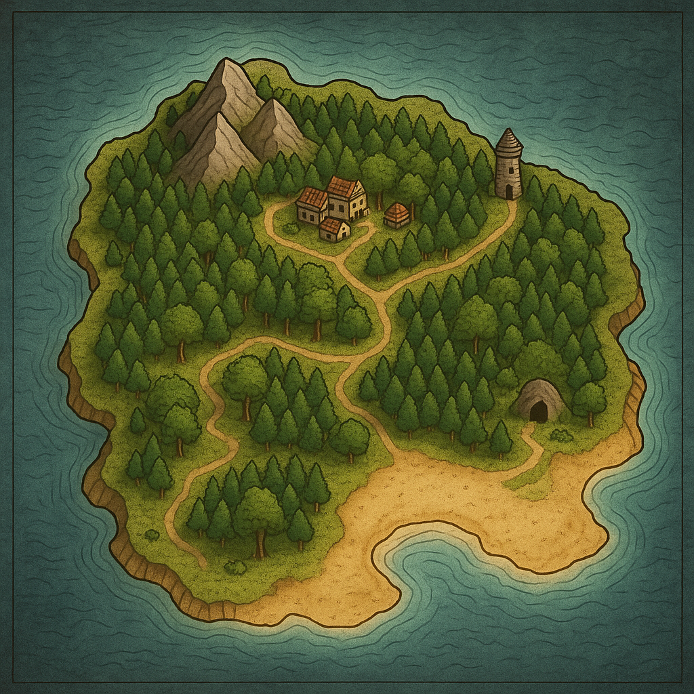
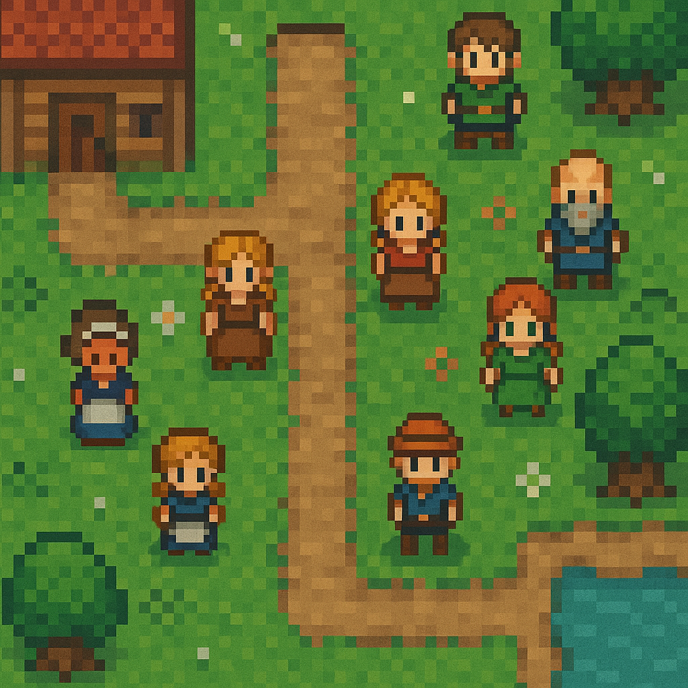
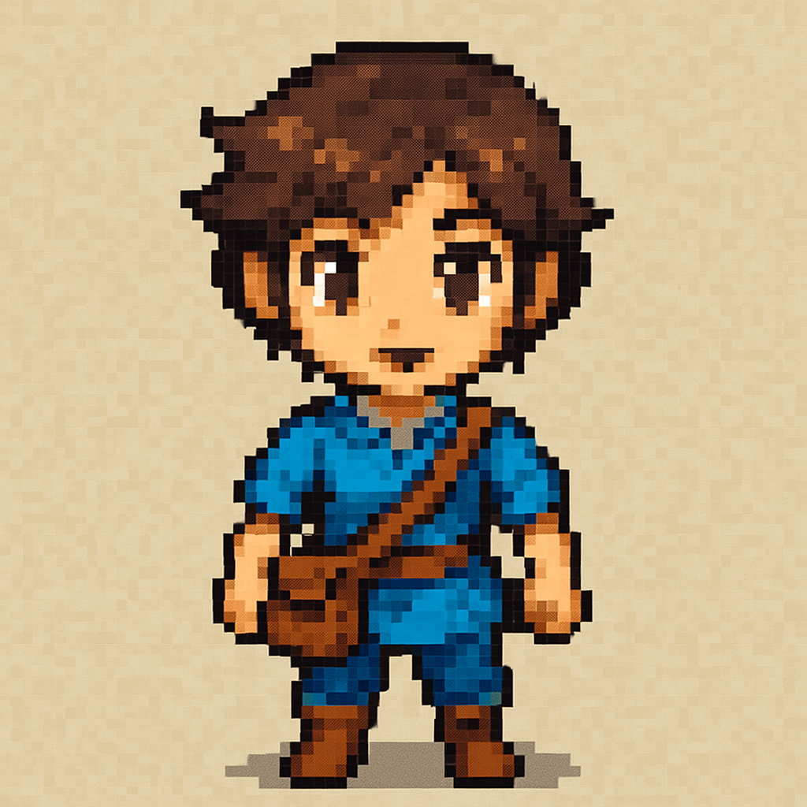
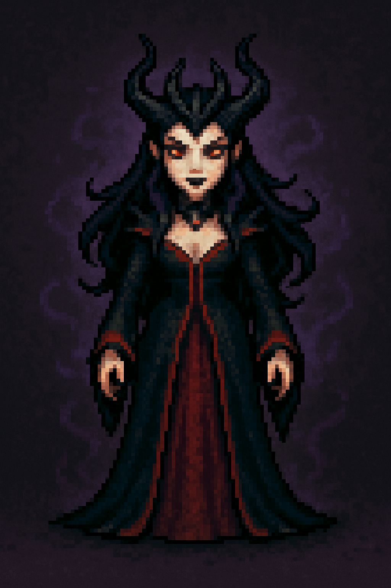

# 🌴 Legend of Eternal Island - 2D RPG Adventure Game

> *An indie 2D top-down RPG game made by [Rida Ouassen](https://github.com/yourprofile), Software Engineer & Game Creator.*

---

## 🎮 Game Overview

**Legend of Eternal Island** is a pixel-art 2D top-down RPG adventure that takes place on a mysterious magical island. You, the hero, arrive on the island without memories and must uncover secrets, fight monsters, and meet many intriguing characters — including the powerful **Queen of Elves** and the **Devil Queen**.

---

## 👤 Creator

**👨‍💻 Rida Ouassen**  
*Software Engineer, Indie Game Developer, and Creative Designer*  
This game is a personal project to showcase skills in:
- Game development using **Godot**
- Pixel art design
- AI-assisted character creation
- Game logic, dialogue, quests, and save system

---

## 🗺️ Features

| Feature               | Description                                                                 |
|-----------------------|-----------------------------------------------------------------------------|
| 🧙 NPC Dialogues       | Dynamic NPCs with dialogues and quest interactions                          |
| 🔊 Sounds & Music      | Attack sounds, chest opening FX, background music                           |
| 🏠 Map System          | External and interior house maps                                            |
| 🎁 Loot System         | Chests and items to loot with inventory management                         |
| 💬 Quests             | Multiple quests from villagers and faction leaders                          |
| 🛡️ Enemies & Combat   | Attack system with weapons, hit sounds, and monster damage                  |
| 💾 Auto Save          | Regular auto-save system                                                    |
| 👸 Female Antagonists | Powerful female characters: Elf Queen and Devil Queen ruling the realms     |

---

## 🧑‍🤝‍🧑 Village NPCs

Each NPC has a background and purpose:

| Name           | Role                     | Description                                       |
|----------------|--------------------------|---------------------------------------------------|
| Elder Mella    | Village elder            | Guides you on the prophecy and the island's lore |
| Blacksmith Tor| Blacksmith               | Provides and upgrades weapons                    |
| Aria          | Herbalist                | Gives healing potions and minor quests           |
| Renna         | Elf Queen (Main Boss)    | Ruler of the enchanted forest                    |
| Nyxara        | Devil Queen (Main Boss)  | Dark ruler seeking to invade the elven lands     |
| Yuto          | Child of prophecy        | Hidden powers that tie into your destiny         |

---

## 🖼️ Game Screenshots

*Village tilemap with interactable NPCs*

*Playable male and female characters*

*Example NPCs created for the village*

---

## 🛠️ Technologies Used
- 🐍 **Python** – for the game engine logic and backend systems
- 🎮 **Pygame** (or specify Godot if you switch)
- 🖼 **Pixel Art (16-bit style)** for all visuals
- 🗺 **Tiled Map Editor** for building maps
- 💾 **SQLite** – for saving game progress, player stats, and inventory
- **Godot Engine 4.x**
- **Tiled Map Editor** (for tilemaps)
- **GIMP/Photoshop** (for pixel art)
- **Git + GitHub** (version control)
- **AI Tools** for generating initial concepts and sprites

---

## 📁 Project Structure

